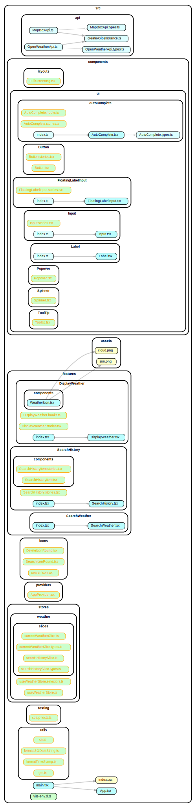

## How to start
- npm install -g pnpm
- pnpm install
- pnpm start

## Storybook
pnpm run storybook

## Project Structure

## Assumptions:
1. The temperature should be in Celsius and should not have decimal points; rounding off is expected.
2. Longitude and latitude are displayed as whole numbers without decimal points.
2. There will only be one page in the near future since it does not seem like this will be a multi-page app (therefore, no react-router-dom).
3. There is a chance of additional feature requirements being added to the project, project structure and library choices are choosen with that in mind.
4. The date displayed is in local time, not the time of the displayed country.
5. The API will only be called after the user has entered at least two characters.
6. The requirement states to use the Open Weather API for weather; however, there is no specific requirement for geo-location data, so another API, Mapbox API, is used.
7. The requirement says to search for both countries and cities. The app allows searching for both. However, since there is no requirement to restrict searches, users can also search for streets, postal codes, places, etc.
8. There is no requirement stating that the search button to the right of the search input must be clickable and no specific requirement for search behaviour. Autocomplete component is chosen because in my humble opinion , it provides a better user experience.

## Regrets due to time limitation
1. SEO improvements
2. Performance optimization
3. Robust unit testing and integration testing (this is due to a config bug that i have not been able to solve in 48h)
4. More refactoring and clean up
5. Properly setup design system
